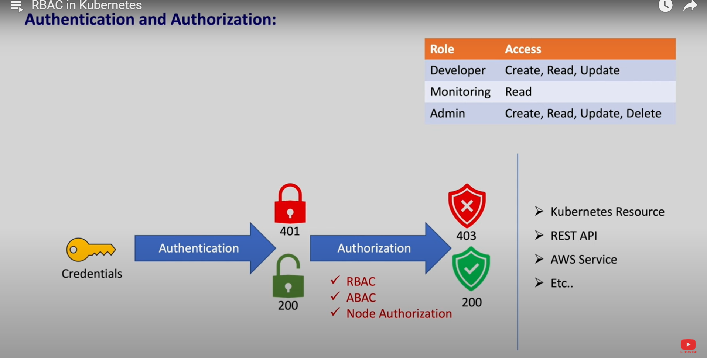

rbac stand for role based access control

which means for certain role we can give access

for example, lets say for developer only read and write access is provided for k8's resources and delete access is not granted.

in k8's user are not created using k8's resource or component. so we need to create user in different manner.

once user is created next step is to create a role using Role resource or component.

after user and role are created, we need to create a roleblinding component which is used to attch user and role.

we also have clusterRole and clusterRoleBinding components for cluster level access.

